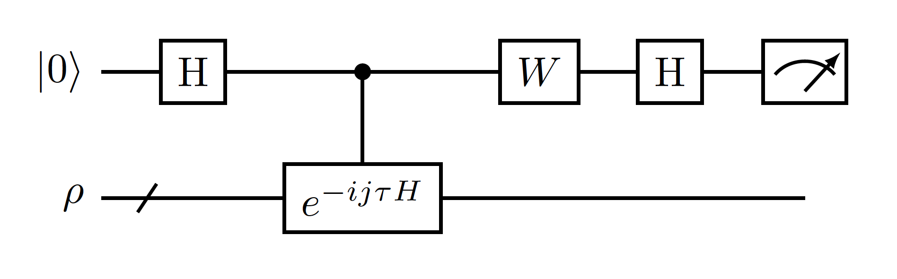

# Reproducing the results from the paper: *Heisenberg-Limited Ground-State Energy Estimation for Early Fault-Tolerant Quantum Computers*

The goal is to study the efficacy of their proposed algorithm by approximating the ground state of a 1D Hubbard Model of variable chain length with parameter $U = 10$, $U/t = 4$, and the open boundary condition.

## Idea:

The algorithm consists of preparing a good initial state (a state with a good-enough overlap with the true ground state of the system) and, by applying the following circuit, one can measure the ancilla in the computation basis and approximate a CDF which is then classically postprocessed to approximate the ground state:

## Notes on numerical experiments:

In the paper, two things are varied: the length of the 1D chain, and the ansatz overlap with the true initial state, $ p_0 = ||<\psi_0 | \rho>||^2 $.

the initial $\rho$ is taken to be the Hartree-Fock solution.

### Progress:

- Created OpenFermion Hamiltonian
- Translated the Hamiltonian into Qulacs observable object

### To-Do:

2. Prepare the Hartree-Fock solution to the 1D Hubbard Hamiltonian
3. Create the time evolution unitary with Qulacs/OpenFermion (unsure about which one to use)
5. Create circuit with Qulacs

### Questions:
- Qulacs Observables:
    - Why should I treat the hamiltonian as an Observable in Qulacs? From what I understood, the circuit requires to do controlled time evolution state $\rho$ and then measuring the ancilla qubit. However, they measure on the computational basis, and to perform time evolution in Qulacs we need $e^{-i j H\tau}$ as a gate, whereas observables cannot update quantum states.

- OpenFermion Hamiltonian:
    - Should the tunneling constant (hopping integral) be positive or negative?
    - Should I stick to the Jordan-Wigner mapping or should I use Bravyi-Kitaev? When should I prefer one over the other?
    -  How does the open boundary condition affect the Hamiltonian? I am assuming that the open boundary condition translates to the following argument when constructing it with OpenFermion:
    
                periodic = False

- Hartree-Fock initial state preparation
    - How do I prepare this state on a quantum computer? They cite a reference (https://doi.org/10.1021/acscentsci.8b00788) where they seem to describe a procedure to do so, but, from what I read, I don't think it is clear if this is what they used to prepare the hartree-fock state.

- Qulacs time evolution unitary:
    - How should I approach this? Should I use Trotterization to approximate it? Or should I diagonalize the Hamiltonian and build the $e^{-i j H\tau}$ operator like that? From Appendix D, it seems like the authors used Trotter (at least for their analysis) but I am a little confused as to what the best approach is. It seems like OpenFermion allows me to easily do both direct exponentiantion and Trotterization, but one of the first Qulacs examples just builds the $e^{-i j H\tau}$ by diagonalizing the Hamiltonian.
